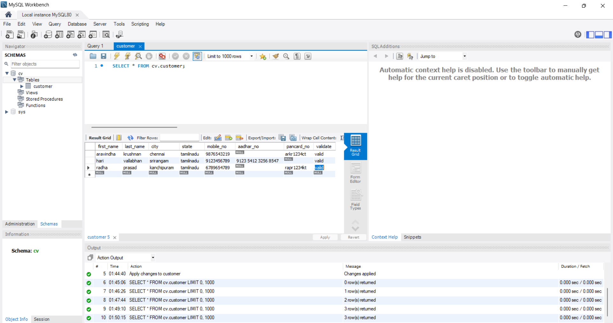

# intenship-in-python
Exercise no 1:
Mobile number,  Pan number and Aadhar number validation with and without using Regular expression.

Step 1 : Get  First name, Last name, State, District , and mobile number as input.

Step 2:  Validate mobile number ( should be 10 digit, alphabets or other special characters , and white spaces in between are not allowed).

Step 3 : To get Pan number or aadhar number , give it as a choice as 1. Pan number, 2. Aadhar.

Step 4 : If the choice is '1'  Pan number validation.
                   <ul>
                   <li>Number of digits = 10, should not contain whitespace or special characters.</li>
                   <li>first 2 digit is from first name's first 2 letter and should be an alphabet.</li>
                   <li>3rd and 4th digits is from last name's first 2 letter.and should be  an alphabet.</li>
                   <li>5th to 8th should be digit(non alphabets or special characters/spaces).</li>
                   <li>9th digit is from District's first letter and  should be an alphabet.</li>
                   <li>The 10th digit is from State's first letter and should be an alphabet.</li>
                   </ul>

step 5: If the choice is '2'. do Aadhar validation.
                  <ul>
                  <li>It should have 12 digits.</li>
                  <li>It should not start with 0 and 1.</li>
                  <li>It should not contain any alphabet and special characters.</li>
                  <li>It should have white space after every 4 digits.</li>
                  </ul>

Step 6 : Check the above conditions if true display its valid else get input again and do revalidation (recursive).

- Do it with RegEx (Regular expressions) and a program without regular expressions.(2 programs)  Go through predefined functions and RegEx in python , and try on your own.
- If you know any Backend DB like postgres , oracle or any SQL lang, connect with python and  try to save the inputs and outputs after validation in the backend. 
- Saving in the backend is optional and it's for your own practice.
- Complete the above task within 2 or 3 days and send me the .py files. 

output

 

database

Exercise 2:

One File A has tax content for multiple states.

Field sequence for different states will be different.

It is a comma separated file.

TN,MH,AP are state codes.

PAN,DOB,NAME,TN,TOTALINCOME,TAXPAID,FNYEAR

PAN,NAME,DOB,AP,TOTALINCOME,TAXPAID,FNYEAR

FNYEAR  NAME,PAN,DOB,MH,TAXPAID,TOTALINCOME

sample data should looks like this:

QWERT2685C,28-10-1985,Suellen,6979773.88,71566.11,MH,2019-2020

Moises,8336341.73,28651.91,AP,SDFDF5865B,2013-2014,26-01-1988

12-02-1986,Jasmine,3752499.26,46335.2,TN,SDFDF7169B,2012-2013

- You need to create sample file data as per above format(same file).
- Create at least 20 records for each state. Have at least 5 states.
- Create a python program that reads this file, parses the fields, connects with ur DB postgres or sql(ur choice)  and inserts into a table.
- Sample output in ur DB should be like below attachment.(all state should be in the same format within one csv).

output
        

